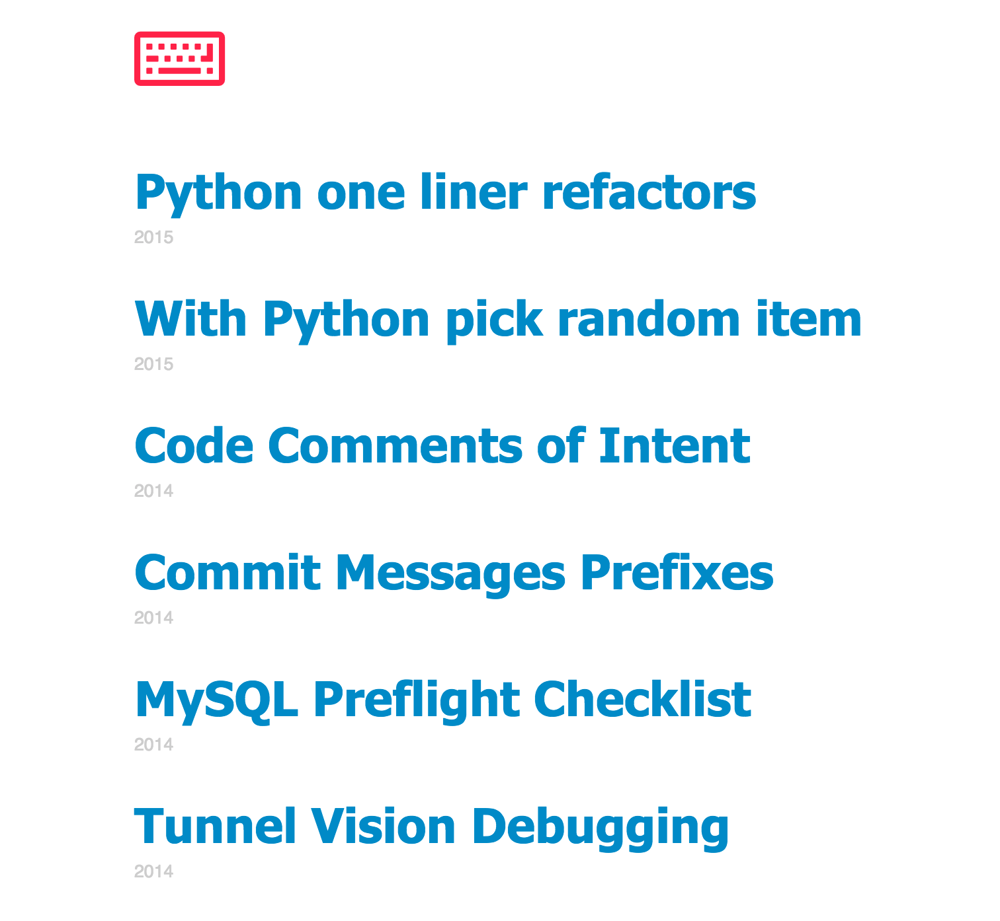

# Gibson
Minimum effort developer blogging.

Building on the work from [snehesht/blog](https://github.com/snehesht/blog) and the styling from
my old blog [fuchida/blog](https://github.com/Fuchida/Archive/tree/master/blog.fuchida.me).

Gibson uses markdown files and git to build a simple blog. For developer who wants
to push to a repo to update their blog, Gibson should be an ideal option.

### Installation

```sh
  >> Git clone https://github.com/Fuchida/gibson.git
  >> pip install -r requirements.txt
```

In `config.py` set `POSTS_GIT_REPO` to point to the Github repo with your posts and set `POSTS_GIT_REPO_SECRET`
with the password for the webhook service. These can also be set as environment variables.

Also be sure to point your POST repo webhook setting to youblog.com/update

```python
POSTS_GIT_REPO = None
POSTS_GIT_REPO_SECRET = None

# Example
# POSTS_GIT_REPO = 'https://github.com/fuchida/posts'
# POSTS_GIT_REPO_SECRET = '<Redacted>'
```

```sh
  >> python src/app.py
  ...
  * Running on http://0.0.0.0:5000/ (Press CTRL+C to quit)
```


